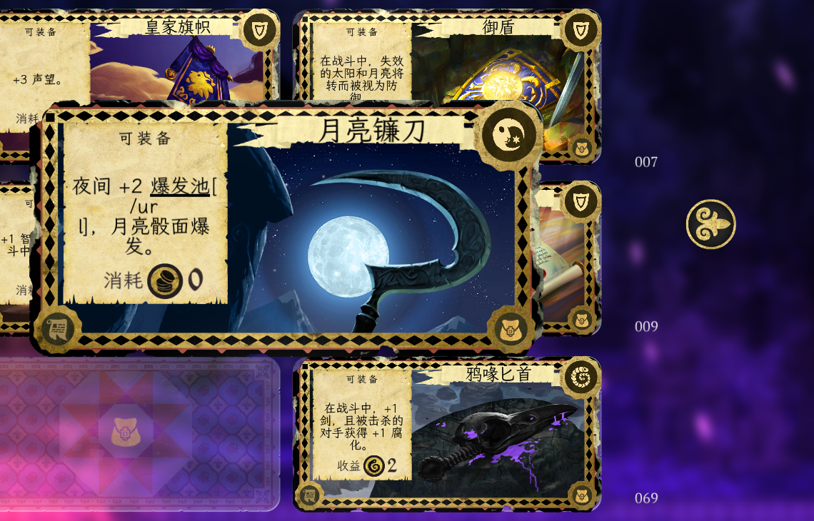
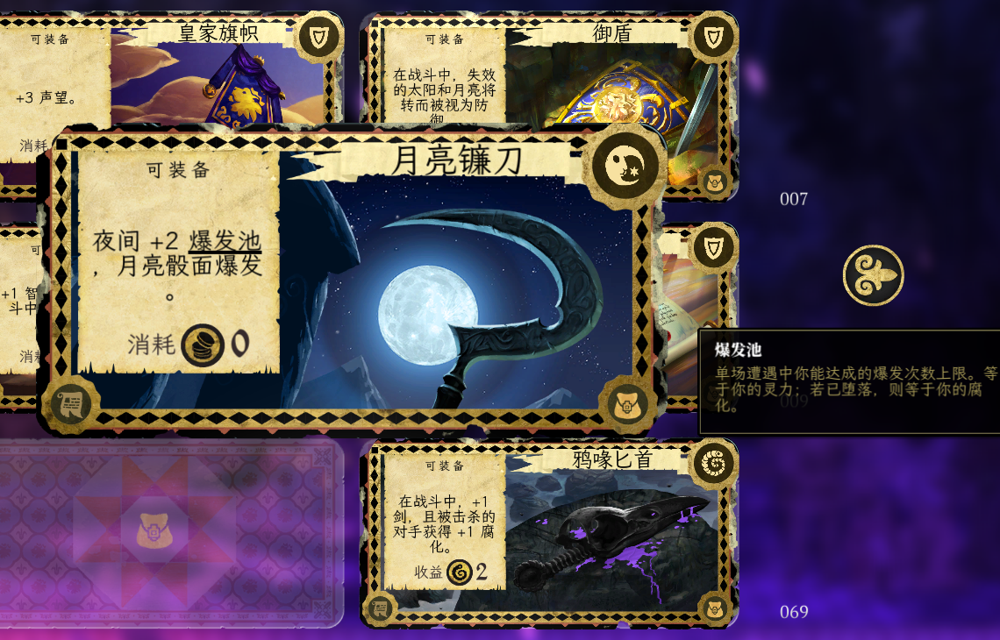

<div align="center">

[简体中文](README.md) · [繁體中文](README_TC.md) · [English](README_EN.md)

<p></p>

<p></p>

# Armello Tooltip Fix

[](LICENSE)
[](#-安装)
[](https://store.steampowered.com/app/290340/Armello/)
[](https://github.com/deserthouse/armello-tooltip-fix/releases)


</div>

<br/>

> **Armello Tooltip Fix** 是一个 [BepInEx](https://github.com/BepInEx/BepInEx) IL2CPP 补丁，修复 Armello 游戏引擎中卡牌描述的 tooltip 链接标签（`[/url]`）在换行时被拆断、泄露为可见乱码文字的 bug。
>
> 🧩 [Armello 简体中文重译补丁](https://github.com/deserthouse/armello-chinese-localization) 的推荐搭配——两者独立安装，互不依赖。

## 🐛 问题描述

Armello 的卡牌描述中包含 tooltip 链接（如卡牌效果中的 **爆发池**、**契约** 等可悬停查看解释的词）。游戏引擎将 `<tooltip_X>内容</tooltip_X>` 转换为 `[url="tooltip://X"][u]内容[/u][/url]` 后交给文本渲染管线。

**Bug**：换行算法可能在 `[/url]` 六个字符的中间断行（如 `[/ur` 在行尾、`l]` 在下一行头），导致标签解析器无法识别完整标签，将其渲染为可见的乱码文字（形如 `[/ur l]`）。

此 bug 存在于游戏引擎本身（Unity 2019.4 / NGUI / IL2CPP）而非第三方修改。官方中文版本通过调整每一行的文本长度来规避此问题，而我不愿意为此妥协，因此制作了这个补丁。需注意任何修改游戏文本导致描述长度变化的 mod 都可能触发此问题，而该补丁在理论上均能将其修复。

### 效果对比（以月亮镰刀卡牌为例，需注意此问题是由游戏引擎本身的 bug 导致的，与第三方修改无关）

**修复前**——`[/url]` 被换行拆断，泄露为可见乱码文字：



**修复后**——文字干净，关键词悬停提示（tooltip）正常工作：



## ✨ 修复方案

通过 [Harmony](https://github.com/pardeike/Harmony) hook `NGUIText.WrapText` 的输出端，在换行完成后检测被 `\n` 拆断的 `[/url]` 标签，移除标签内的换行符使标签恢复完整，让解析器正确消费。

- ✅ 修复 `[/url]` 可见泄露
- ✅ 不影响 tooltip 链接功能（悬停、点击均正常）
- ✅ 不影响其他富文本标签（`[b]` `[i]` `[u]` `[c]` 等）
- ✅ 不修改任何游戏文件（纯运行时补丁）
- ✅ 控制台已关闭，玩家无感知

## 🚀 安装

**[📥 前往 Releases 下载最新版本](https://github.com/deserthouse/armello-tooltip-fix/releases)**

1. 下载 `ArmelloTooltipFix-v1.0.zip` 并解压
2. 将解压出的全部文件（`BepInEx/` `dotnet/` `winhttp.dll` 等）复制到 Armello 游戏根目录（Steam 库中右键 Armello → 管理 → 浏览本地文件）
3. 启动游戏，完成

> 补丁不修改任何游戏文件，删除 `winhttp.dll` 即可停用补丁；如需彻底清理，一并删除 `BepInEx/`、`dotnet/`、`doorstop_config.ini` 与 `.doorstop_version`。

### 与文本 mod 的兼容性

本补丁与任何 Armello 文本/翻译 mod 兼容（包括 [armello-chinese-localization](https://github.com/deserthouse/armello-chinese-localization)）。两者独立安装、互不依赖。

## 🔧 给开发者

### 技术细节

| 层 | 说明 |
|---|---|
| 引擎 | Unity 2019.4.11f1 / IL2CPP metadata v24 / x64 |
| 框架 | BepInEx 6.0.0-pre.2 (Unity.IL2CPP.win-x64) |
| Hook | Harmony patch on `NGUIText.WrapText` (3 overloads) |
| 修复 | Postfix 正则修复被 `\n` 拆断的 `[/url]` 标签 |

### 从源码构建

```bash
git clone https://github.com/deserthouse/armello-tooltip-fix.git
cd armello-tooltip-fix/src
dotnet build -c Release
# 输出: bin/Release/net8.0/ArmelloUrlFix.dll
```

项目文件中的 DLL 引用路径需要指向你本机的 BepInEx interop 目录。

### 已知局限

- 仅修复 `[/url]` 标签跨行（6 字符标签，最容易触发）
- 理论上 `[/u]`（4 字符）等其他标签也可能跨行，但实际发生率极低
- 如果未来出现其他标签泄露，可扩展正则匹配

## 🤖 AI 使用声明

本补丁不含任何人类成分，绝大多数工作都由 **AI** 完成。

## 📄 版权声明

- 本补丁为非商业粉丝项目，仅供已购买 Armello 的玩家个人使用
- 《Armello》版权归 League of Geeks 所有，本仓库与官方无任何关联
- 补丁按"现状"（AS IS）提供，使用风险自负
- 发行包内捆绑的 BepInEx 运行时与第三方组件（含 LGPL 组件）版权归各自所有者，完整清单与许可全文见 [THIRD_PARTY_NOTICES.md](THIRD_PARTY_NOTICES.md)（发行包内随附 `THIRD-PARTY-NOTICES.txt`）
- 发行包内捆绑的 BepInEx 运行时与第三方组件（含 LGPL 组件）版权归各自所有者，完整清单与许可全文见 [THIRD_PARTY_NOTICES.md](THIRD_PARTY_NOTICES.md)（发行包内随附 `THIRD-PARTY-NOTICES.txt`）

## ⚠️ 免责声明

- 本补丁不修改任何游戏文件，但运行时 hook 可能与游戏更新不兼容
- 因使用本补丁导致的任何直接或间接损失，维护者不承担责任
- 使用本补丁即表示你已阅读并同意上述条款
